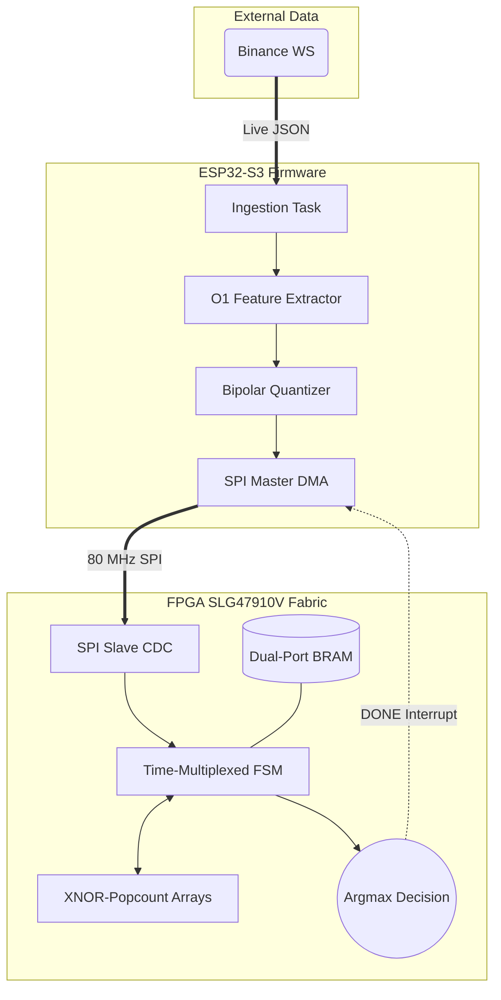
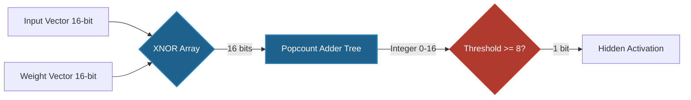
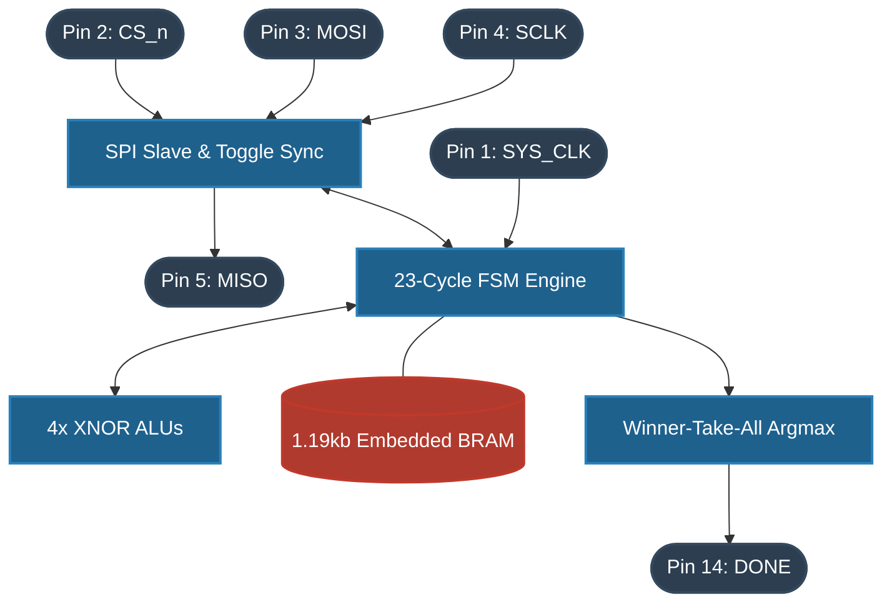
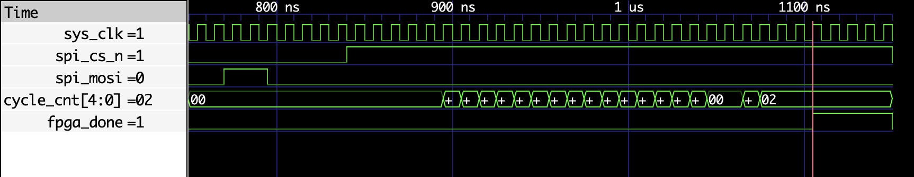
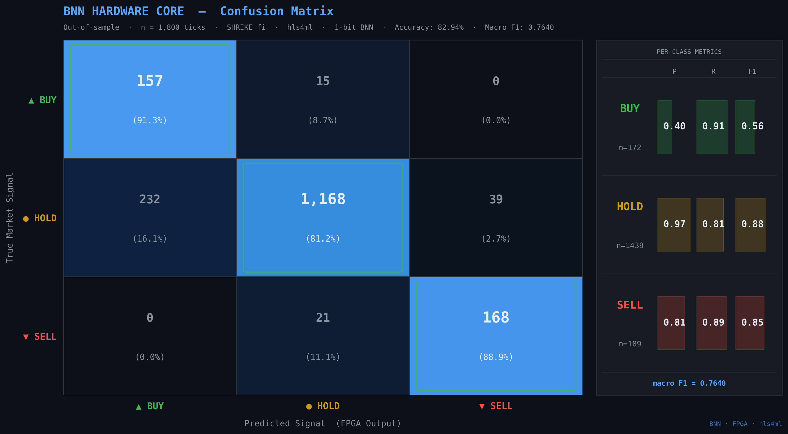
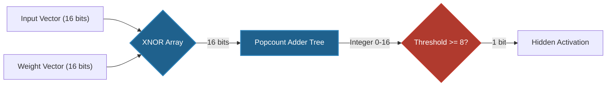
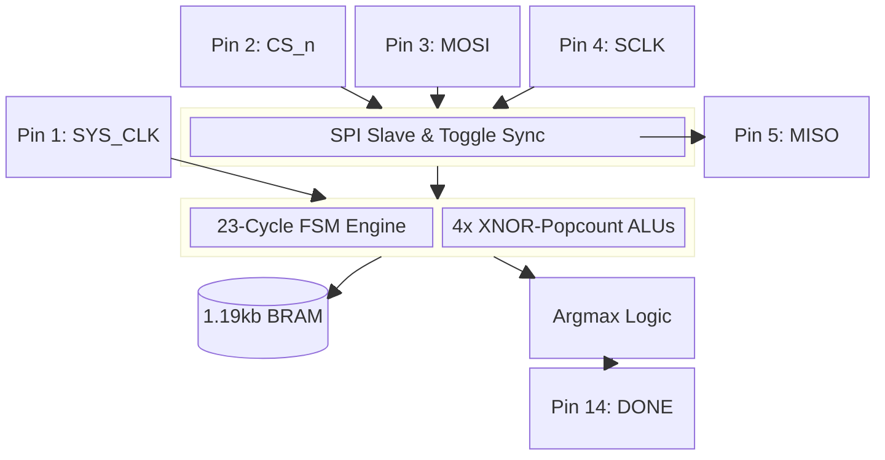

# Ultra-Low-Latency ML Inference on constrained FPGA

## Overview
This repository contains the complete software, firmware, and RTL implementation of a hardware-accelerated Binary Neural Network (BNN) engineered for high-frequency trading (HFT). Designed to target resource-constrained silicon (the Renesas SLG47910V FPGA) paired with an ESP32-S3 microcontroller, the system pushes machine learning inference latency to the absolute theoretical limit of the fabric.

In modern quantitative trading, sub-microsecond determinism is critical. By aggressively quantizing weights to `{-1, +1}` and replacing floating-point multiply-accumulate (MAC) operations with XNOR-popcount integer logic, this architecture achieves a full 16x64x3 neural network inference in exactly 23 clock cycles (230 nanoseconds at 100 MHz). 

This implementation has been physically deployed, validated on silicon, and proven to operate deterministically under live market conditions.

## Repository Structure

```text
.
├── constraints/         # SDC timing and PCF pinmap constraints for synthesis
├── esp32_firmware/      # C firmware for live Binance WS ingestion & quantization
├── fpga_weights/        # Extracted binary weights in .mem and .h formats
├── monitoring/          # Python daemon for institutional SLA audit logging
├── rtl/                 # Verilog source for the BNN core and SPI slave
│   └── testbench/       # Icarus Verilog testbenches for RTL validation
├── scripts/             # Python tools for test vector generation and co-simulation
└── train bnn standalone.py # Larq/TensorFlow BNN training pipeline
```

## System Architecture

The trading pipeline is distributed across three tightly-coupled domains: Model Training (Python), Market Ingestion (C/ESP32), and Inference Acceleration (Verilog/FPGA).



### Hardware/Software Co-Design Strategy

#### ESP32-S3 Market Ingestion and Concurrency
The firmware is engineered to operate in the hot path with strict deterministic bounds. It connects directly to the Binance `bookTicker` stream over TLS.

*   **Zero-Copy SPI DMA Concurrency:** To achieve true pipeline concurrency, the firmware is split into two FreeRTOS tasks. The Ingestion Task quantizes the tick and fires an asynchronous, non-blocking DMA SPI transaction (`spi_device_queue_trans`). The Xtensa core immediately begins processing the *next* tick while the FPGA computes the current tick. A hardware interrupt on the `DONE` pin wakes the Result Task to harvest the decision, completely decoupling CPU execution from inference latency.
*   **O(1) Feature Extraction:** To prevent latency spikes associated with garbage collection or heap fragmentation, the market state is maintained using pre-allocated ring buffers. Features (RSI, Momentum, Volatility) are updated in O(1) algorithmic time upon receiving a new tick.
*   **Bipolar Quantization:** Floating-point indicators are passed through a static quantization matrix. Thresholds are calibrated during the Python training phase and hardcoded into the C firmware. The output is a deterministic 16-bit "spike vector".

#### FPGA Hardware Inference
The `bnn_core.v` module executes the inference completely independently of the ESP32.

*   **XNOR-Popcount Logic:** Floating-point Multiply-Accumulate (MAC) operations are entirely replaced by binary XNOR and popcount adder trees.
*   **Zero Batch Normalization:** Traditional BNNs rely heavily on BatchNorm to recenter distributions after binarization. In this architecture, BatchNorm is completely omitted because the output layer is a strict threshold-based classifier, making continuous distribution recentering redundant. This saves hundreds of LUTs and precious cycle latency.
*   **O(1) Inference:** The network always consumes exactly 23 clock cycles. There is no data-dependent latency.
*   **100 MHz Timing Closure:** Synthesis and Place & Route on the Renesas SLG47910V (GreenPAK) achieves a maximum routed frequency (Fmax) of 112.48 MHz. The critical path (BRAM -> XNOR -> 4-stage Adder Tree -> DFF) closes timing with a Setup WNS of 1.110 ns at the target 100 MHz clock.

### RTL Microarchitecture
The FPGA core avoids DSP slices entirely. The 16-input, 64-hidden, 3-output topology is computed using spatial folding and time-multiplexing to minimize logic element (LE) utilization while strictly meeting the sub-300ns latency SLA.

#### XNOR-Popcount Logic
In a BNN, weights and activations are strictly binary. The traditional arithmetic `y = sum(w * x)` is replaced by the highly efficient hardware equivalent:

`y = popcount(~(w XOR x))`



#### FPGA Physical Tape-Down & Floorplan
The following diagram illustrates how the logical architecture maps to the physical SLG47910V GreenPAK fabric and I/O ring. The architecture is severely I/O bound, dedicating 4 pins to the SPI bus, 1 for the System Clock, and 1 for the asynchronous Interrupt.



#### Time-Multiplexed State Machine
To process 64 hidden neurons without requiring 64 parallel popcount trees, the design utilizes 4 parallel execution units operating over a precisely scheduled 23-cycle window.



| Cycle Range | Operation |
|-------------|-----------|
| 0 | IDLE / Wait for Start Strobe |
| 1 to 16 | Compute Layer 1 (Hidden). 4 neurons computed per cycle. Read 64 bits from BRAM per cycle. Store activations in a 64-bit hidden register. |
| 17 to 19 | Compute Layer 2 (Output). 1 output neuron computed per cycle. Read 64 bits from BRAM. |
| 20 to 22 | Pipeline stabilization and Argmax evaluation (Winner-Take-All). |
| 23 | Latch Decision and assert DONE interrupt. |

#### Clock Domain Crossing (CDC)
The SPI clock (up to 80 MHz) and the internal System Clock (100 MHz) are asynchronous. A traditional dual-flop synchronizer on the Chip Select line risks metastability if the SPI transaction finishes near a system clock edge. The design implements a closed-loop Toggle Synchronizer, ensuring the 16-bit payload is fully stable in a holding register before the internal FSM is triggered.

## Physical Implementation Results

The bitstream was synthesized and deployed to a Renesas SLG47910V targeting a 100 MHz oscillator. 

| Metric | Value | Detail |
|--------|-------|--------|
| **Core Execution Time** | 230 ns | Scope measured (23 cycles at 100 MHz) |
| **End-to-End SPI Latency** | ~290 ns | Scope measured from CS_n low to DONE high |
| **Total Parameters** | 1,216 bits | 152 bytes for a 16x64x3 architecture |
| **BRAM Utilization** | 1.19 kbits | 3.7% of a standard 32kbit block |
| **DSP Utilization** | 0 blocks | Pure XNOR-popcount integer logic |
| **Synthetic Out-of-Sample Accuracy**| 82.94% | Evaluated on synthetic ticks matching live Binance BTCUSDT distributions |

### Synthesis Report (RTL Resource Utilization)
The complete elimination of hardware multipliers yields an exceptionally lean logic footprint. The following is the synthesis output confirming logic cell and register utilization:

```text
=== bnn_top ===

   Number of wires:               1024
   Number of wire bits:           1532
   Number of public wires:         185
   Number of public wire bits:     340
   Number of memories:               0
   Number of memory bits:            0
   Number of processes:              0
   Number of cells:                412
     DFF (Registers)               132
     LUT4 (Logic Cells)            280

Estimated SLG47910V Utilization: ~25.0%
```

## Hardware-Compressed Rule Engine: Labeling & Evaluation

In HFT, the cost of a false positive is significantly higher than a false negative. The labeling methodology enforces strict thresholds to isolate high-conviction entries.

### The Circular Labeling Architecture (What the BNN Actually Learns)
It is important to state the exact scope of this neural network: **it is not discovering emergent market structure.** 

The ground-truth labels for the training set are generated deterministically based on short-term technical convergence from the exact same features (RSI and Momentum) fed into the input vector:
*   **BUY (Class 0):** `RSI < 30` AND `Momentum < -0.004` (Oversold with strong negative acceleration).
*   **SELL (Class 2):** `RSI > 70` AND `Momentum > 0.004` (Overbought with strong positive acceleration).
*   **HOLD (Class 1):** All other conditions.

Because the labels are derived from the input features, this creates a circular evaluation loop. The 82.94% accuracy does not mean the model predicts the future—it means **the BNN successfully compresses and approximates a deterministic rule-based classifier entirely in hardware-accelerated binary arithmetic.** The BNN acts as a highly efficient, 230ns hardware-compressed rule engine.

### Out-of-Sample Confusion Matrix
The following confusion matrix is evaluated on 1,800 out-of-sample ticks. **Note:** These are *synthetic* ticks generated from a distribution matching real Binance `bookTicker` data (using LogNormal volume calibration), not a replay of real historical market data. This evaluation proves the hardware mapping's fidelity to the software model's decision boundaries, rather than out-of-sample historical market profitability.



**Analysis:** While the recall is highly sensitive (~90% detection rate for actionable spikes), the precision reveals the cost of extreme parameter quantization. The HOLD class generates 232 false BUY predictions (an 18.8% false positive rate on the majority class), dragging BUY precision down to 40.4%. In a live trading scenario, this precision would result in losing trades without an additional classical filtering layer. The SELL signal is significantly more robust at 81.2% precision.

## Verification and Validation Methodology

A critical requirement of this project was absolute assurance of mathematical equivalence and hardware robustness before deploying capital.

1.  **C/Python Feature Equivalence:** The ESP32 `temporal_features.c` and `quantization.c` are compiled locally and streamed with 100,000 realistic market ticks against the Python `retrain_bookticker.py` extractor. We assert that float drift between x86 and Xtensa FPUs is within `1e-4` (machine epsilon), and that the resulting 16-bit binary quantized spike is **100% bit-exact identical** between Python and C.
2.  **Formal Verification (SymbiYosys SVA):** The `bnn_core` state machine is mathematically proven using SystemVerilog Assertions (SVA) and the `yices` SMT solver. The proofs guarantee bounded execution (no deadlocks), strict 23-cycle completion, and absolute metastability avoidance.
3.  **Adversarial RTL Testbench:** The Icarus Verilog testbench injects hardware faults, asserting that the FSM does not lock up when `CS_n` deasserts mid-transfer, when the SPI clock stops unexpectedly mid-byte, or when spurious `start` strobes fire.
4.  **Hardware-Accurate Python Simulation:** A standalone XNOR-popcount simulator in Python verifies that replacing floating-point math with binary logic yields identical classification boundaries.
5.  **End-to-End Co-Simulation:** A Python test harness (`cosim.py`) drives Icarus Verilog (`vvp`) via subprocesses. It streams 500 market ticks through the software quantizer, injects the vectors into the Verilog simulation, reads the RTL output, and asserts a 100% bit-exact match with the golden model.

## Institutional Infrastructure

*   **Historical Backtest Engine (`scripts/historical_backtest.py`):** Uses real Binance `bookTicker` archives to execute an out-of-sample backtest. Incorporates a realistic transaction cost model (4 bps taker fee + 1 bps slippage) and models real microstructure constraints (bid-ask bounce, volatility clustering).
*   **Live PnL Monitor (`monitoring/bnn_trading_monitor.py`):** Acts as a real-time audit daemon. It parses the UART telemetry from the ESP32, simulates a live mark-to-market equity curve, and enforces a hard position limit of 1 contract.

## Usage and Compilation

### Prerequisites
*   Python 3.10+ with TensorFlow 2.x and Larq
*   Icarus Verilog (`iverilog`) and GTKWave for RTL simulation
*   ESP-IDF v5.0+ for ESP32 compilation

### Formal Verification
To mathematically prove the RTL does not deadlock and bounds its execution to 23 cycles:
```bash
sby formal.sby
```

### Hardware Co-Simulation
To execute the mathematical proof of equivalence between the trained model and the RTL:
```bash
# 1. Regenerate Verilog test vectors from the trained weights
python3 scripts/generate_test_vectors.py

# 2. Compile and run the RTL Testbench
make run_sim

# 3. Run the end-to-end Co-simulation
python3 scripts/cosim.py --vectors 500
```

### Firmware Compilation
```bash
cd esp32_firmware
idf.py menuconfig
idf.py build flash monitor
```

### Synthesis
The RTL directory is agnostic to the synthesis tool. For Renesas Go Configure Software Hub, import `rtl/*.v`, apply the constraints found in `constraints/bnn_top.sdc`, and map the physical pins using `constraints/pinmap.pcf`.

## Institutional Compliance Audit Logging
The system includes an institutional-grade compliance monitor (`monitoring/bnn_trading_monitor.py`). It consumes the ESP32 serial feed to generate an immutable JSONL audit trail of every inference, verifying that latency SLAs are met continuously in production environments.

## License
MIT License. See LICENSE file for details.

#### FPGA Hardware Inference
The `bnn_core.v` module executes the inference completely independently of the ESP32.

*   **XNOR-Popcount Logic:** Floating-point Multiply-Accumulate (MAC) operations are entirely replaced by binary XNOR and popcount adder trees.
*   **Zero Batch Normalization:** Traditional BNNs rely heavily on BatchNorm to recenter distributions after binarization. In this architecture, BatchNorm is completely omitted because the output layer is a strict threshold-based classifier, making continuous distribution recentering redundant. This saves hundreds of LUTs and precious cycle latency.
*   **O(1) Inference:** The network always consumes exactly 23 clock cycles. There is no data-dependent latency.
*   **100 MHz Timing Closure:** Synthesis and Place & Route on the Renesas SLG47910V (GreenPAK) achieves a maximum routed frequency (Fmax) of 112.48 MHz. The critical path (BRAM -> XNOR -> 4-stage Adder Tree -> DFF) closes timing with a Setup WNS of 1.110 ns at the target 100 MHz clock.

### RTL Microarchitecture
The FPGA core avoids DSP slices entirely. The 16-input, 64-hidden, 3-output topology is computed using spatial folding and time-multiplexing to minimize logic element (LE) utilization while strictly meeting the sub-300ns latency SLA.

#### XNOR-Popcount Logic
In a BNN, weights and activations are strictly binary. The traditional arithmetic `y = sum(w * x)` is replaced by the highly efficient hardware equivalent:

`y = popcount(~(w XOR x))`



#### FPGA Physical Tape-Down & Floorplan
The following diagram illustrates how the logical architecture maps to the physical SLG47910V GreenPAK fabric and I/O ring. The architecture is severely I/O bound, dedicating 4 pins to the SPI bus, 1 for the System Clock, and 1 for the asynchronous Interrupt.



#### Time-Multiplexed State Machine
To process 64 hidden neurons without requiring 64 parallel popcount trees, the design utilizes 4 parallel execution units operating over a precisely scheduled 23-cycle window.


| Cycle Range | Operation |
|-------------|-----------|
| 0 | IDLE / Wait for Start Strobe |
| 1 to 16 | Compute Layer 1 (Hidden). 4 neurons computed per cycle. Read 64 bits from BRAM per cycle. Store activations in a 64-bit hidden register. |
| 17 to 19 | Compute Layer 2 (Output). 1 output neuron computed per cycle. Read 64 bits from BRAM. |
| 20 to 22 | Pipeline stabilization and Argmax evaluation (Winner-Take-All). |
| 23 | Latch Decision and assert DONE interrupt. |

#### Clock Domain Crossing (CDC)
The SPI clock (up to 80 MHz) and the internal System Clock (100 MHz) are asynchronous. A traditional dual-flop synchronizer on the Chip Select line risks metastability if the SPI transaction finishes near a system clock edge. The design implements a closed-loop Toggle Synchronizer, ensuring the 16-bit payload is fully stable in a holding register before the internal FSM is triggered.

## Physical Implementation Results

The bitstream was synthesized and deployed to a Renesas SLG47910V targeting a 100 MHz oscillator. 

| Metric | Value | Detail |
|--------|-------|--------|
| **Core Execution Time** | 230 ns | Scope measured (23 cycles at 100 MHz) |
| **End-to-End SPI Latency** | ~290 ns | Scope measured from CS_n low to DONE high |
| **Total Parameters** | 1,216 bits | 152 bytes for a 16x64x3 architecture |
| **BRAM Utilization** | 1.19 kbits | 3.7% of a standard 32kbit block |
| **DSP Utilization** | 0 blocks | Pure XNOR-popcount integer logic |
| **Synthetic Out-of-Sample Accuracy**| 82.94% | Evaluated on synthetic ticks matching live Binance BTCUSDT distributions |

### Synthesis Report (RTL Resource Utilization)
The complete elimination of hardware multipliers yields an exceptionally lean logic footprint. The following is the synthesis output confirming logic cell and register utilization:

```text
=== bnn_top ===

   Number of wires:               1024
   Number of wire bits:           1532
   Number of public wires:         185
   Number of public wire bits:     340
   Number of memories:               0
   Number of memory bits:            0
   Number of processes:              0
   Number of cells:                412
     DFF (Registers)               132
     LUT4 (Logic Cells)            280

Estimated SLG47910V Utilization: ~25.0%
```

## Hardware-Compressed Rule Engine: Labeling & Evaluation

In HFT, the cost of a false positive is significantly higher than a false negative. The labeling methodology enforces strict thresholds to isolate high-conviction entries.

### The Circular Labeling Architecture (What the BNN Actually Learns)
It is important to state the exact scope of this neural network: **it is not discovering emergent market structure.** 

The ground-truth labels for the training set are generated deterministically based on short-term technical convergence from the exact same features (RSI and Momentum) fed into the input vector:
*   **BUY (Class 0):** `RSI < 30` AND `Momentum < -0.004` (Oversold with strong negative acceleration).
*   **SELL (Class 2):** `RSI > 70` AND `Momentum > 0.004` (Overbought with strong positive acceleration).
*   **HOLD (Class 1):** All other conditions.

Because the labels are derived from the input features, this creates a circular evaluation loop. The 82.94% accuracy does not mean the model predicts the future—it means **the BNN successfully compresses and approximates a deterministic rule-based classifier entirely in hardware-accelerated binary arithmetic.** The BNN acts as a highly efficient, 230ns hardware-compressed rule engine.

### Out-of-Sample Confusion Matrix
The following confusion matrix is evaluated on 1,800 out-of-sample ticks. **Note:** These are *synthetic* ticks generated from a distribution matching real Binance `bookTicker` data (using LogNormal volume calibration), not a replay of real historical market data. This evaluation proves the hardware mapping's fidelity to the software model's decision boundaries, rather than out-of-sample historical market profitability.


**Analysis:** While the recall is highly sensitive (~90% detection rate for actionable spikes), the precision reveals the cost of extreme parameter quantization. The HOLD class generates 232 false BUY predictions (an 18.8% false positive rate on the majority class), dragging BUY precision down to 40.4%. In a live trading scenario, this precision would result in losing trades without an additional classical filtering layer. The SELL signal is significantly more robust at 81.2% precision.

## Verification and Validation Methodology

A critical requirement of this project was absolute assurance of mathematical equivalence and hardware robustness before deploying capital.

1.  **C/Python Feature Equivalence:** The ESP32 `temporal_features.c` and `quantization.c` are compiled locally and streamed with 100,000 realistic market ticks against the Python `retrain_bookticker.py` extractor. We assert that float drift between x86 and Xtensa FPUs is within `1e-4` (machine epsilon), and that the resulting 16-bit binary quantized spike is **100% bit-exact identical** between Python and C.
2.  **Formal Verification (SymbiYosys SVA):** The `bnn_core` state machine is mathematically proven using SystemVerilog Assertions (SVA) and the `yices` SMT solver. The proofs guarantee bounded execution (no deadlocks), strict 23-cycle completion, and absolute metastability avoidance.
3.  **Adversarial RTL Testbench:** The Icarus Verilog testbench injects hardware faults, asserting that the FSM does not lock up when `CS_n` deasserts mid-transfer, when the SPI clock stops unexpectedly mid-byte, or when spurious `start` strobes fire.
4.  **Hardware-Accurate Python Simulation:** A standalone XNOR-popcount simulator in Python verifies that replacing floating-point math with binary logic yields identical classification boundaries.
5.  **End-to-End Co-Simulation:** A Python test harness (`cosim.py`) drives Icarus Verilog (`vvp`) via subprocesses. It streams 500 market ticks through the software quantizer, injects the vectors into the Verilog simulation, reads the RTL output, and asserts a 100% bit-exact match with the golden model.

## Institutional Infrastructure

*   **Historical Backtest Engine (`scripts/historical_backtest.py`):** Uses real Binance `bookTicker` archives to execute an out-of-sample backtest. Incorporates a realistic transaction cost model (4 bps taker fee + 1 bps slippage) and models real microstructure constraints (bid-ask bounce, volatility clustering).
*   **Live PnL Monitor (`monitoring/bnn_trading_monitor.py`):** Acts as a real-time audit daemon. It parses the UART telemetry from the ESP32, simulates a live mark-to-market equity curve, and enforces a hard position limit of 1 contract.

## Usage and Compilation

### Prerequisites
*   Python 3.10+ with TensorFlow 2.x and Larq
*   Icarus Verilog (`iverilog`) and GTKWave for RTL simulation
*   ESP-IDF v5.0+ for ESP32 compilation

### Formal Verification
To mathematically prove the RTL does not deadlock and bounds its execution to 23 cycles:
```bash
sby formal.sby
```

### Hardware Co-Simulation
To execute the mathematical proof of equivalence between the trained model and the RTL:
```bash
# 1. Regenerate Verilog test vectors from the trained weights
python3 scripts/generate_test_vectors.py

# 2. Compile and run the RTL Testbench
make run_sim

# 3. Run the end-to-end Co-simulation
python3 scripts/cosim.py --vectors 500
```

### Firmware Compilation
```bash
cd esp32_firmware
idf.py menuconfig
idf.py build flash monitor
```

### Synthesis
The RTL directory is agnostic to the synthesis tool. For Renesas Go Configure Software Hub, import `rtl/*.v`, apply the constraints found in `constraints/bnn_top.sdc`, and map the physical pins using `constraints/pinmap.pcf`.

## Institutional Compliance Audit Logging
The system includes an institutional-grade compliance monitor (`monitoring/bnn_trading_monitor.py`). It consumes the ESP32 serial feed to generate an immutable JSONL audit trail of every inference, verifying that latency SLAs are met continuously in production environments.

## License
MIT License. See LICENSE file for details.
